# Invoice Application

Invoice Application, satış ve fatura işlemlerini yönetmek için geliştirilmiş bir web uygulamasıdır. Ürün kataloğunu görüntüleyebilir, sepet oluşturabilir, sipariş hazırlayabilir ve oluşturulan faturaları yazdırabilirsiniz.

Arayüz tamamen Türkçedir.

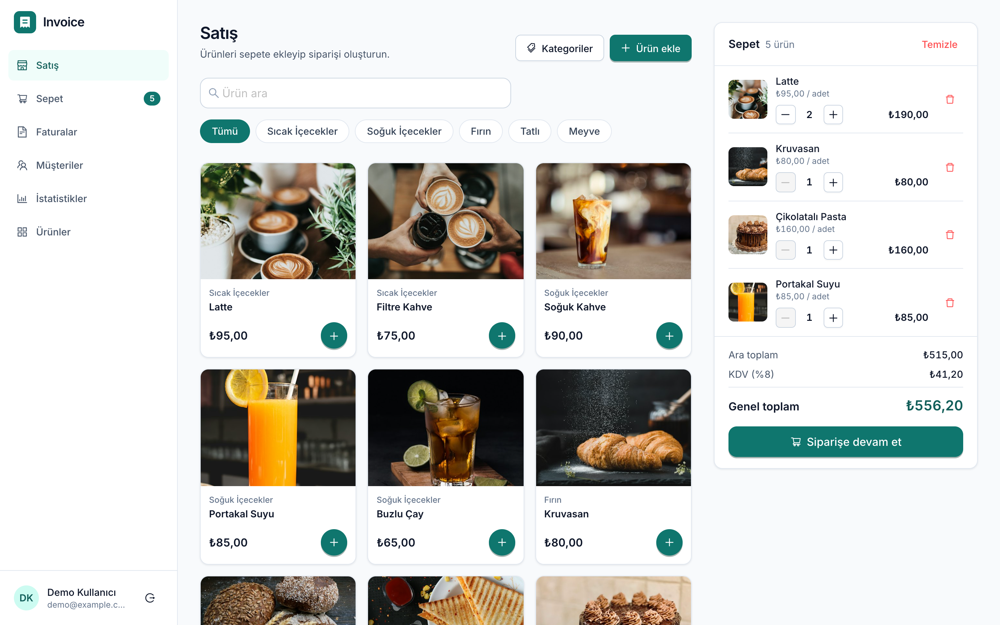

## Genel Bakış

Uygulama, küçük bir işletmenin günlük satış sürecini temel alır:

1. Oturum açın.
2. Kategorilere veya aramaya göre filtrelenmiş ürün kataloğundan ürün seçin.
3. Sepeti inceleyin ve ürün adetlerini düzenleyin.
4. Müşteri bilgilerini ve ödeme yöntemini belirleyerek siparişi tamamlayın.
5. Oluşturulan faturayı açın ve yazdırın.

Ürün ve kategori yönetimi, müşteri görünümü ve satış istatistikleri de uygulamanın diğer özellikleri arasındadır.

## Özellikler

- **Kimlik doğrulama arayüzü** – Kayıt olma, giriş yapma ve çıkış yapma ekranları.
- **Ürün yönetimi** – Ürün oluşturma, listeleme, güncelleme ve silme arayüzleri; yönetim tablosunda arama ve sıralama.
- **Kategori yönetimi** – Kategori oluşturma, yeniden adlandırma ve silme ekranları.
- **Sepet** – Ürün ekleme, adet değiştirme, ürün kaldırma ve sepeti temizleme. Sepet bilgileri `localStorage` üzerinde saklanır.
- **Sipariş oluşturma** – Müşteri adı, telefon numarası ve ödeme yöntemi seçimi (nakit veya kredi kartı).
- **Faturalar** – Aranabilir ve sıralanabilir fatura listesi; ödeme durumunu gösteren etiketler ve fatura numaraları.
- **Fatura yazdırma** – Uygulama arayüzünden bağımsız, A4 boyutunda yazdırmaya uygun fatura görünümü.
- **Müşteriler** – Sipariş bilgilerine dayalı müşteri listesi; sipariş sayısı, toplam harcama ve son sipariş tarihi.
- **İstatistikler** – Ciro, satış, müşteri ve ürün toplamları; günlük ciro ve ödeme yöntemine göre gelir grafikleri.

## Teknoloji Yığını

| Teknoloji | Kullanım amacı |
| --- | --- |
| React 18 (Create React App) | Bileşen tabanlı kullanıcı arayüzü |
| Redux Toolkit | Merkezi durum yönetimi |
| RTK Query | Veri istekleri, önbellekleme ve durum yönetimi |
| React Router 6 | Sayfa yönlendirme |
| Ant Design 5 | Arayüz bileşenleri ve tasarım sistemi |
| `@ant-design/plots` | Grafikler ve istatistik görselleştirmeleri |
| Tailwind CSS | Yardımcı CSS sınıflarıyla stil yönetimi |
| `react-to-print` | Fatura yazdırma işlemleri |

## Frontend Mimarisi

Uygulamanın istemci tarafı, sayfa ve bileşen odaklı bir yapıda düzenlenmiştir.

```text
invoice-application/
├── client/
│   ├── public/
│   └── src/
│       ├── components/
│       │   ├── auth/
│       │   ├── bills/
│       │   ├── cart/
│       │   ├── categories/
│       │   ├── common/
│       │   ├── layout/
│       │   ├── products/
│       │   └── statistics/
│       ├── config/
│       │   ├── theme
│       │   └── company details
│       ├── pages/
│       ├── redux/
│       │   ├── store
│       │   ├── API slice
│       │   └── cart slice
│       ├── utils/
│       │   ├── formatting
│       │   ├── search
│       │   └── error messages
│       ├── App.jsx
│       └── index.js
└── docs/
    └── screenshots/
```

### Mimari Yaklaşım

- **Merkezi durum yönetimi:** Redux Toolkit ile uygulama genelindeki durum yönetilir.
- **Veri işlemleri:** RTK Query, veri istekleri ve önbellekleme için kullanılır.
- **Sepet yönetimi:** Sepet, ayrı bir Redux slice üzerinden yönetilir. Ara toplamlar ve diğer değerler selector fonksiyonlarıyla hesaplanır.
- **Bileşen tabanlı yapı:** Sayfalar, `components/` klasöründeki yeniden kullanılabilir bileşenlerden oluşturulur.
- **Tasarım sistemi:** Ant Design teması ve Tailwind yapılandırması ortak bir renk, yazı tipi, boşluk, köşe yuvarlama ve gölge sistemi kullanır.
- **Sayfa yönlendirme:** React Router ile sayfalar ve uygulama içi gezinme yönetilir.

## Ekran Görüntüleri

Tüm ekran görüntüleri demo verileri kullanılarak hazırlanmıştır.

### Giriş

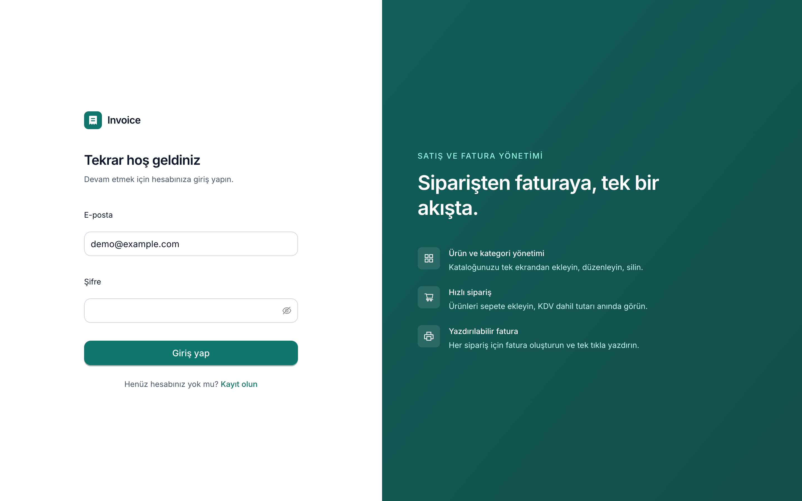

### Satış Ekranı


### Sepet

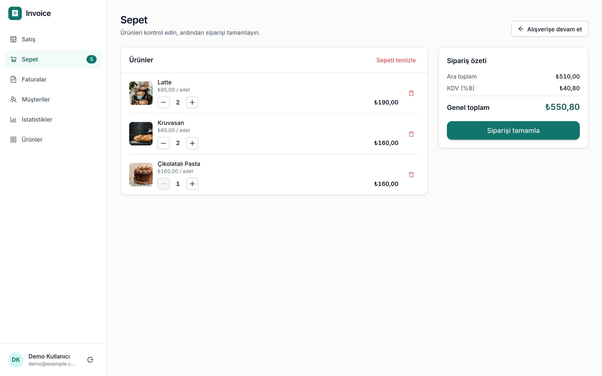

### Sipariş Oluşturma

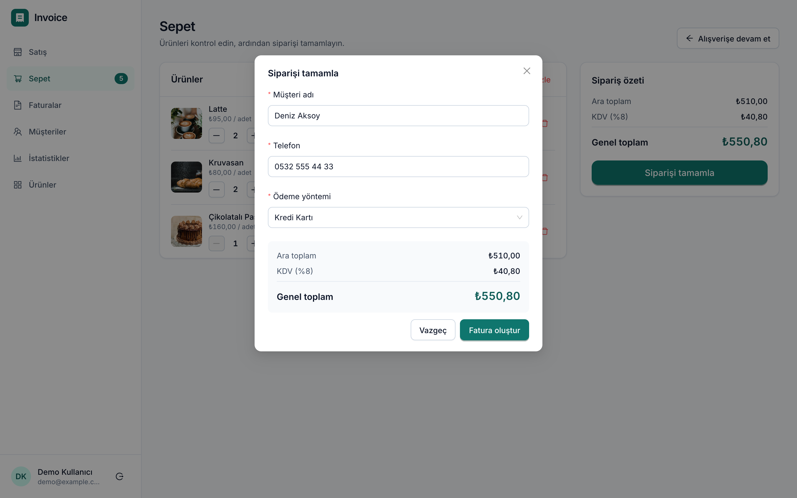

### Fatura

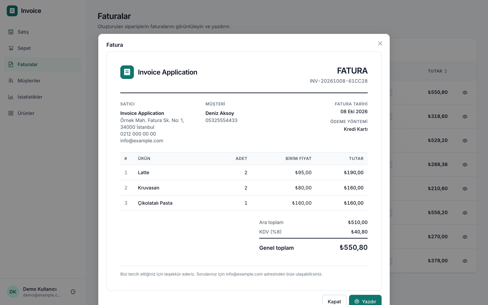

Yazdırma çıktısının örneği: [Fatura PDF örneği](docs/screenshots/invoice-print.pdf).

### Faturalar

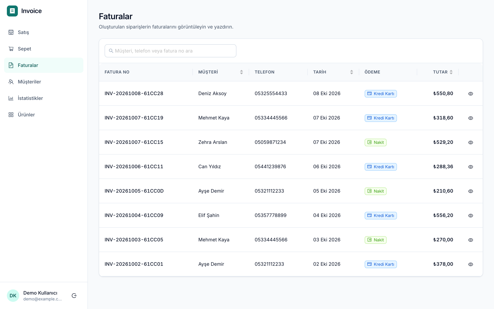

### Müşteriler

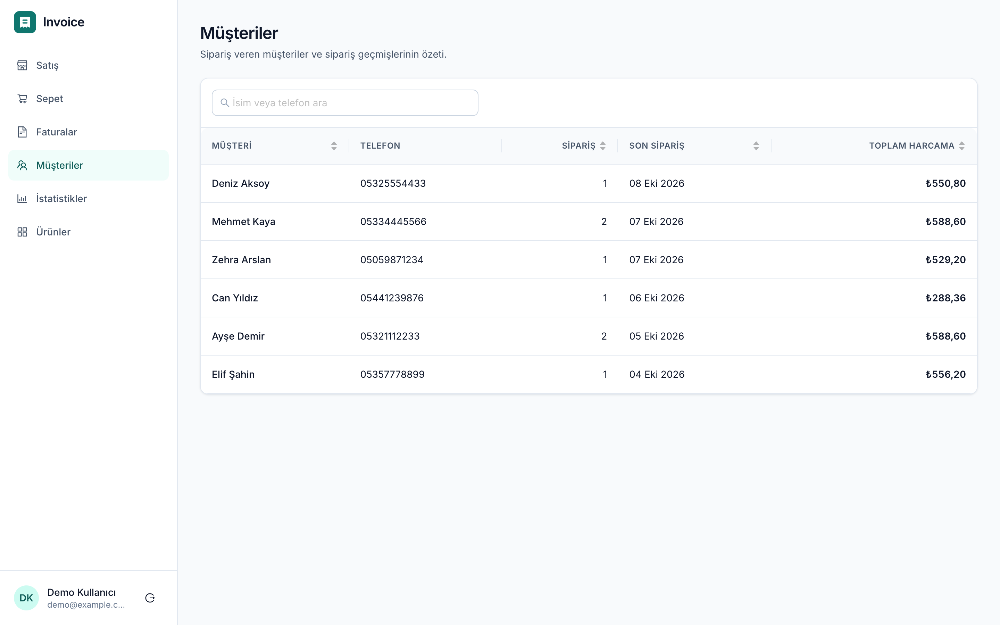

### İstatistikler

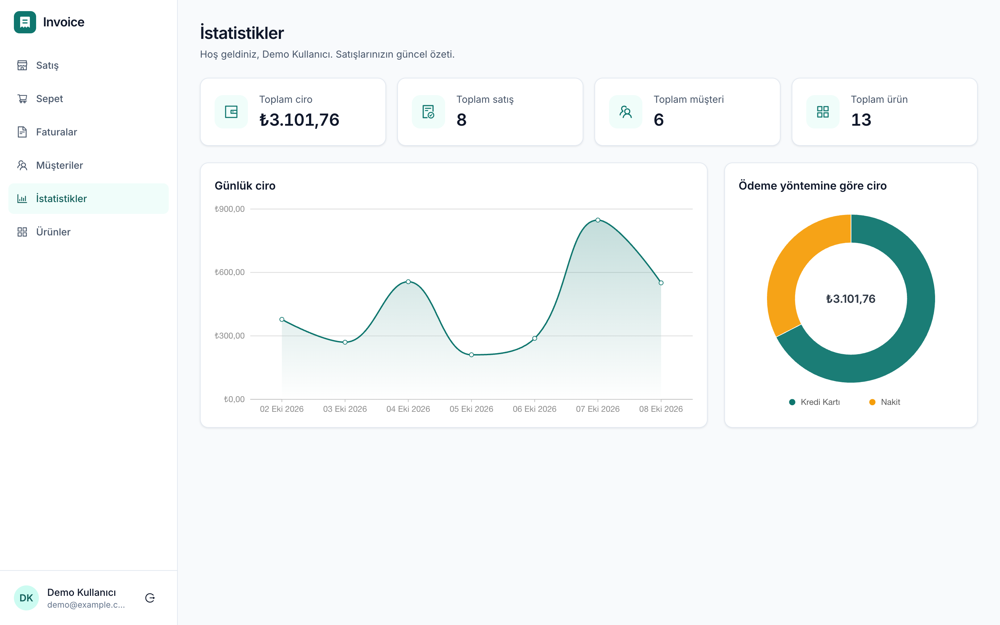

### Ürün Yönetimi

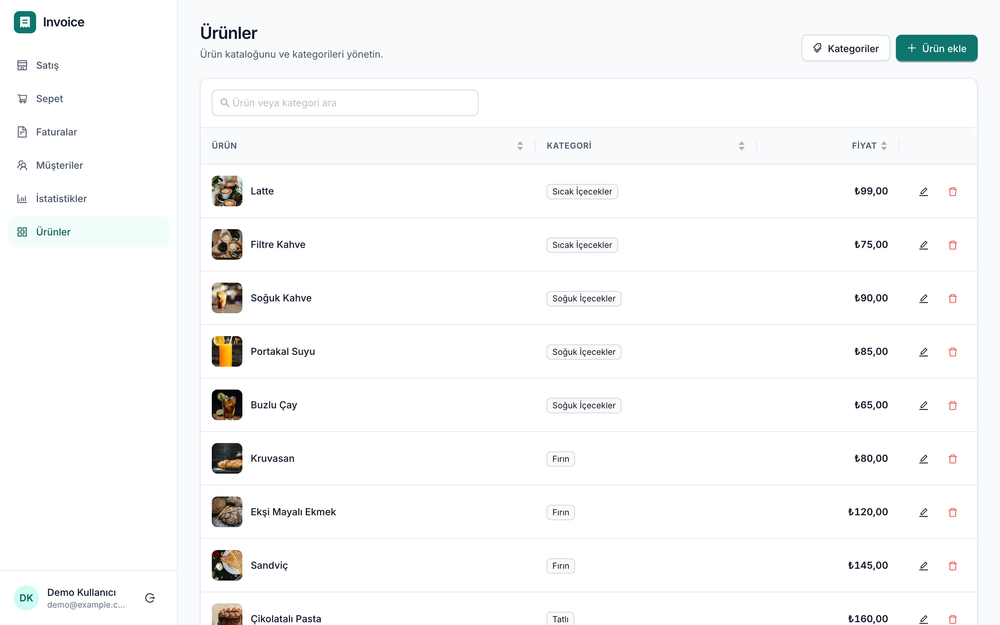

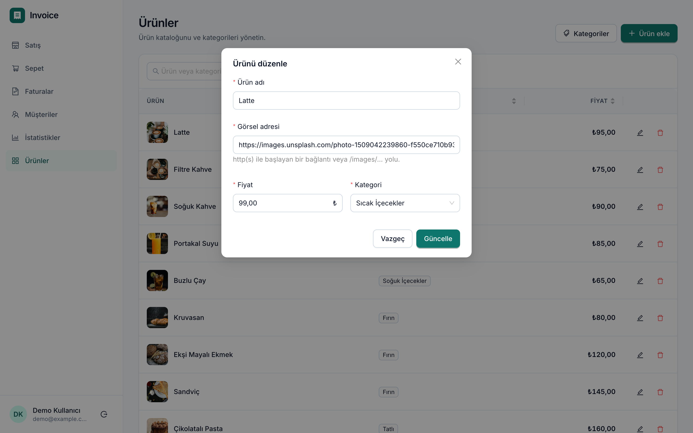

### Kategori Yönetimi

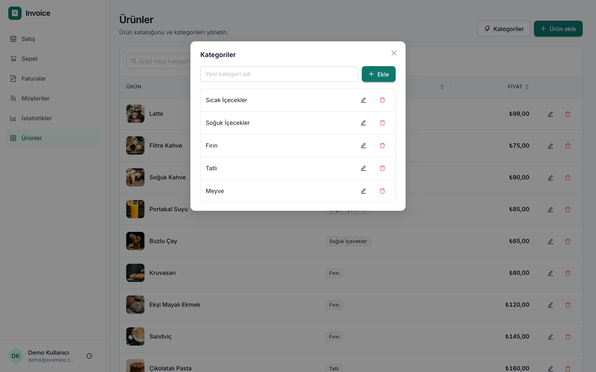

### Mobil Görünüm

<p>
  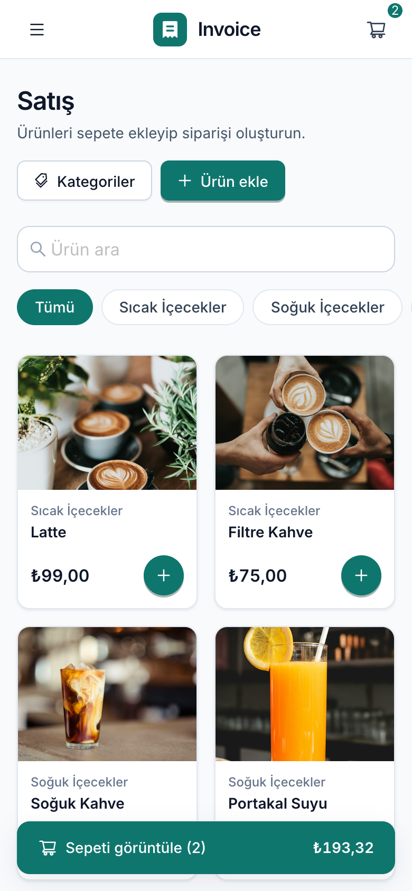
  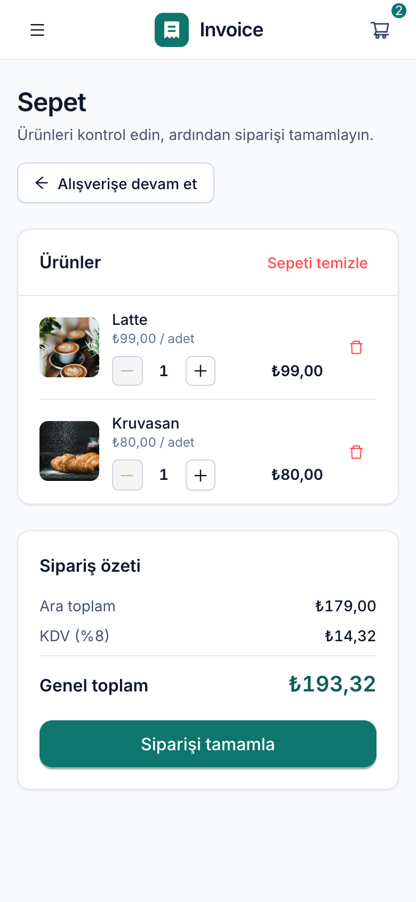
  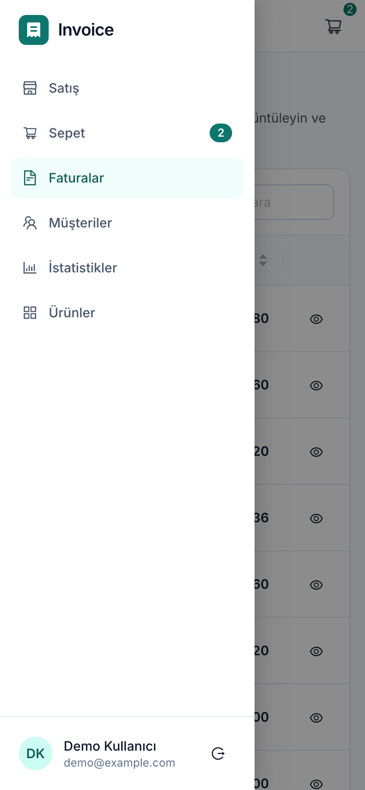
</p>

## Arayüz ve Kullanıcı Deneyimi İyileştirmeleri

- Ant Design teması ve Tailwind ile uyumlu, ortak bir tasarım sistemi oluşturuldu.
- Masaüstündeki üst ikon çubuğu yerine kenar çubuğu, mobil cihazlarda ise açılır gezinme menüsü kullanıldı.
- Ürün kartları; sabit görsel oranı, kategori etiketi, fiyat ve sepete ekleme düğmesiyle yeniden tasarlandı.
- Sepet, duyarlı bir liste düzenine dönüştürüldü. Ürün adedi kontrolleri, satır toplamları ve belirgin bir sipariş özeti eklendi.
- Fatura tasarımı gerçek bir belge görünümüne uygun şekilde düzenlendi. Satıcı, müşteri, fatura numarası, tarih, ödeme yöntemi, ürün satırları, vergi ve toplam bilgileri gösterilir.
- Yeni sipariş oluşturulduğunda ilgili fatura doğrudan açılır.
- Faturalar, müşteriler ve ürünler sayfalarındaki ayrı sütun filtreleri yerine ortak bir arama alanı kullanıldı.
- Yükleme iskeletleri, boş durum ekranları ve yeniden deneme seçeneği içeren hata durumları eklendi.
- Formlarda tutarlı etiketler, alan içi doğrulama, yükleme durumundaki düğmeler ve açık başarı/hata mesajları kullanıldı.
- **Erişilebilirlik:** Anlamlı HTML yapıları ve başlıklar, uygun düğme ve bağlantılar, ikon düğmelerinde etiketler, görünür odak göstergeleri, atlama bağlantısı ve WCAG AA düzeyini hedefleyen metin kontrastı uygulandı.

## Kurulum

**Gereksinimler:** Node.js 18.11 veya üzeri.

Projenin istemci klasörüne geçin ve bağımlılıkları yükleyin:

```bash
cd client
npm install
cp .env.example .env
npm start
```

Uygulama varsayılan olarak `http://localhost:3000` adresinde açılır.

## Kullanılabilir Komutlar

```bash
npm run lint
npm test
npm run build
```

| Komut | Açıklama |
| --- | --- |
| `npm start` | Geliştirme sunucusunu başlatır |
| `npm run lint` | Kod kalitesini denetler |
| `npm test` | Testleri çalıştırır |
| `npm run build` | Üretim derlemesini oluşturur |

## Bilinen Sınırlamalar

- Sepet bilgileri `localStorage` üzerinde saklanır.
- Uygulamanın gerçek zamanlı verileri ve bazı işlemleri, yapılandırılmış veri hizmetlerine bağlı olabilir.
- Fatura yazdırma görünümü A4 boyutuna göre tasarlanmıştır.
- Projenin test kapsamı ve tarayıcılar arası uyumluluğu ayrıca doğrulanmalıdır.
